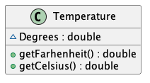
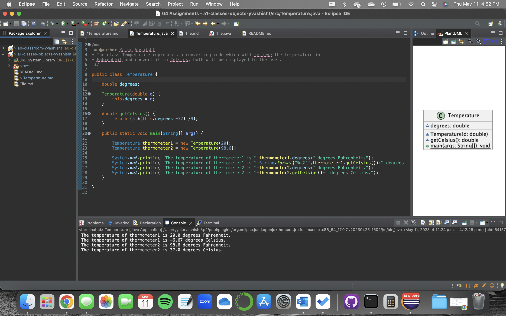

# Temperature report
Author: Yajur Vashisht

## UML class diagram

@startuml

class Temperature {

~ Degrees : double
+ getFarhenheit() : double
+ getCelsius() : double

}

@enduml

## Specification

The class Temperature represents a converting code which will receive the temperature in
Fahrenheit and convert it to Celsius, both will be displayed to the user.

## Execution and Testing

