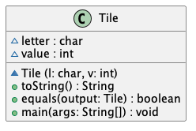
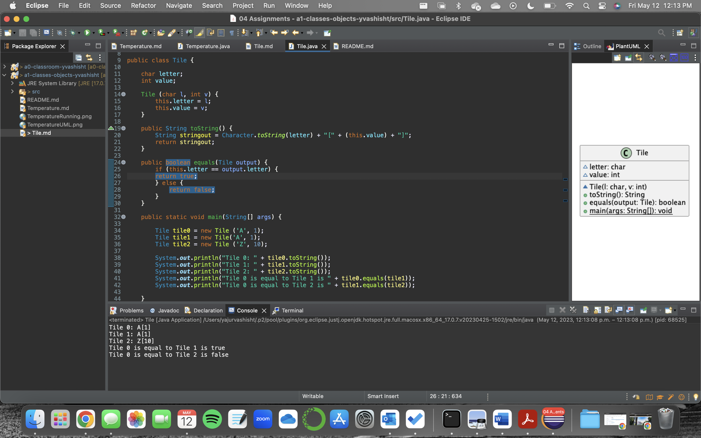

# Tile report
Author: Yajur Vashisht

## UML class diagram

@startuml

class Tile {

~ letter : char

~ value : int

~ Tile (l: char, v: int)

+ toString() : String
+ equals(output: Tile) : boolean
+ main(args: String[]) : void

}

@enduml

## Specification

The class Tile uses a character named letter and an integer named value as well as the methods toString() and equals() to determine if the Tile instances match and displays their letter and value. It also displays whether or not the letters are equal.

## Execution and Testing

# Reflection

I enjoyed the fact that the assignments mimicked what we did in class quite closely while still being relatively challenging. I disliked that everything felt as though it ramped up quite quickly and there was no real bridge between set up and fairly challenging coding exercises. However, this motivated me to learn the Java syntax more carefully as without it I would have not bothered!
