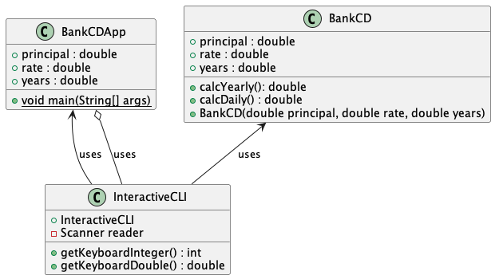
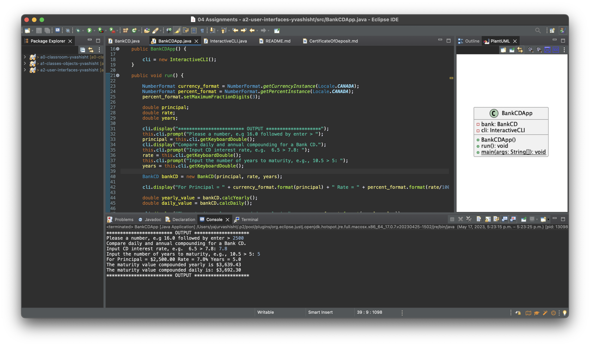

# Certificate of Deposit Report

Author: Yajur Vashisht

## UML class diagram

@startuml

class BankCDApp {

	+ principal : double
	+ rate : double
	+ years : double
	+ {static} void main(String[] args)

}

class BankCD {

	+ principal : double
	+ rate : double
	+ years : double
	+ calcYearly(): double
	+ calcDaily() : double
	+ BankCD(double principal, double rate, double years)

}

class InteractiveCLI {

	+ InteractiveCLI
	- Scanner reader
	+ getKeyboardInteger() : int
	+ getKeyboardDouble() : double
	
}

BankCDApp <-- InteractiveCLI : uses
BankCD <-- InteractiveCLI : uses
BankCDApp o-- InteractiveCLI : uses

@enduml

## Execution and Testing

# Reflection

I enjoyed making an interface that can interact with people like I see in apps and such. Originally I tried doing the assignment without the use of our notes and found it very difficult, I had to model BankCD after the squarerootapp we did in class. 
