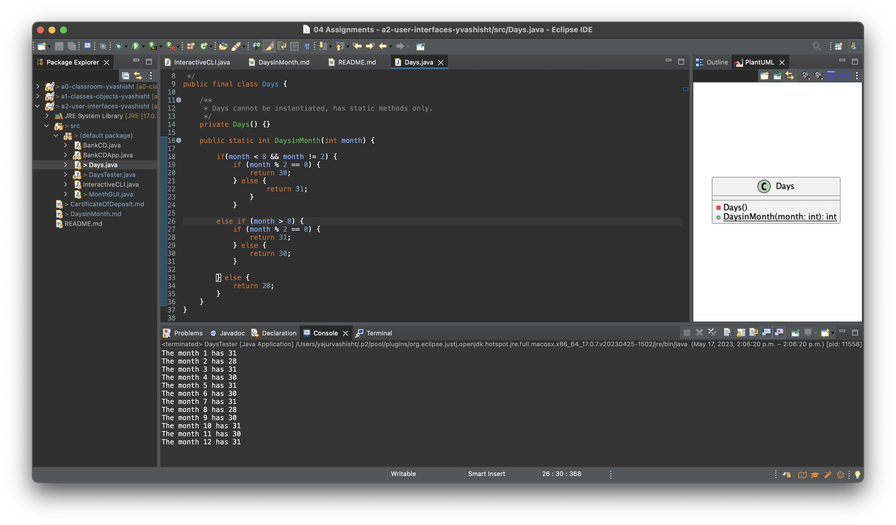
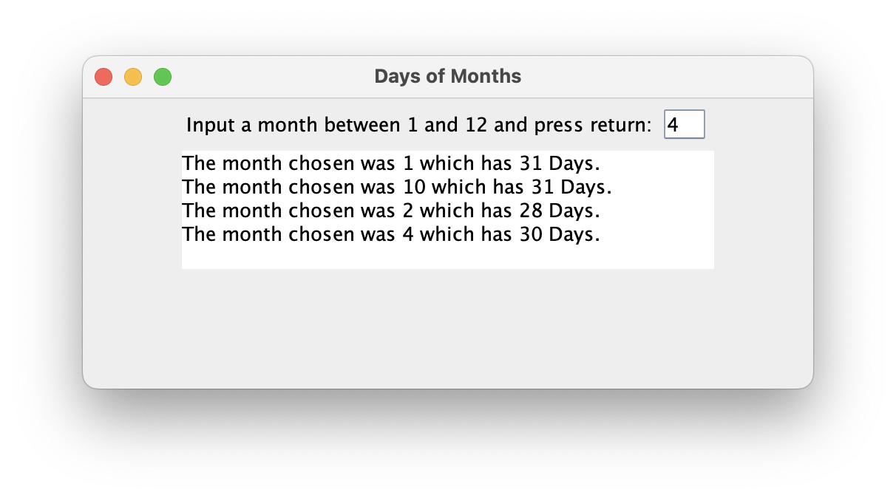

# Days in Month report

Author: Yajur Vashisht

## UML class diagram

@startuml

interface ActionListener

~class Days {

	- days()
	+ {static} int DaysinMonth
	+ int month

}

~class DaysTester {

	+{static} void main(String[] args)

}

~class MonthGUI {

	- JTextField inputField; 
	- private JTextArea display;
	+ int month

}

ActionListener  <|.. MonthGUI

@enduml

## Execution and Testing

**Testing `Days` class**

**Days in Month GUI Usage**

