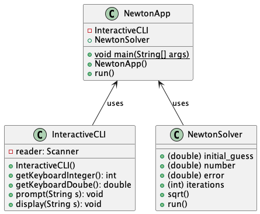
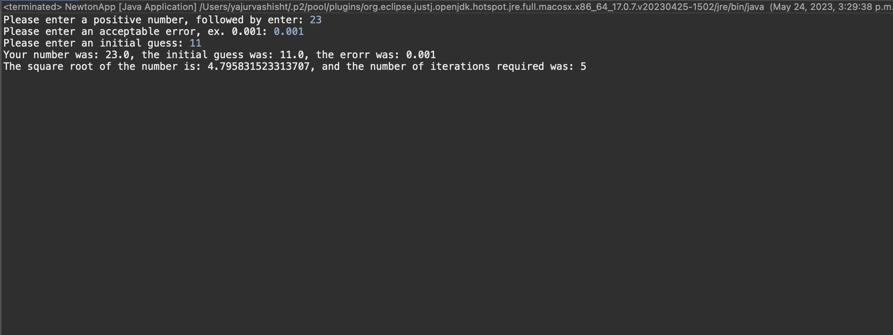
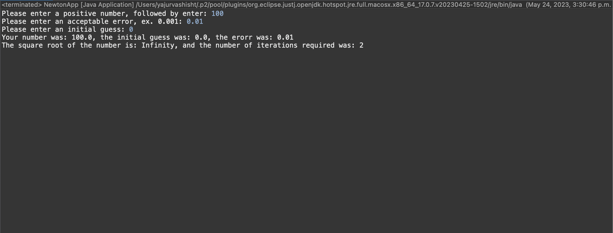
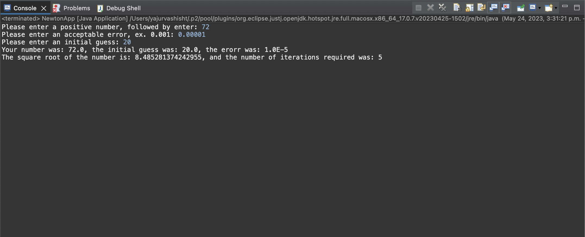

# Newton report

Author: Yajur Vashisht

## UML class diagram

@startuml

class NewtonApp {

	+{static} void main(String[] args)
	-InteractiveCLI
	+NewtonSolver
	+NewtonApp()
	+run()

}

class InteractiveCLI {

	-reader: Scanner 
	+InteractiveCLI()
	+getKeyboardInteger(): int
	+getKeyboardDoube(): double
	+prompt(String s): void
	+display(String s): void
	
}

class NewtonSolver {

	+(double) initial_guess
	+(double) number
	+(double) error
	+(int) iterations
	+sqrt()
	+run()

}

NewtonApp <-- InteractiveCLI : uses
NewtonApp <-- NewtonSolver : uses

@enduml

## Execution and Testing

Screenshot demonstrating successful execution and outputs for at least 3 numbers. 
Explain why you chose these numbers for your test.

The numbers I chose and the reasons why were:

23 - My favourite basketball player, Lebron James
100 - Who doesnt like getting 100% on a test?!
72 - I just like how round of a number 72 is 
