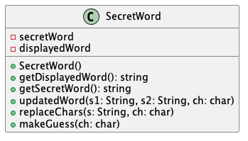
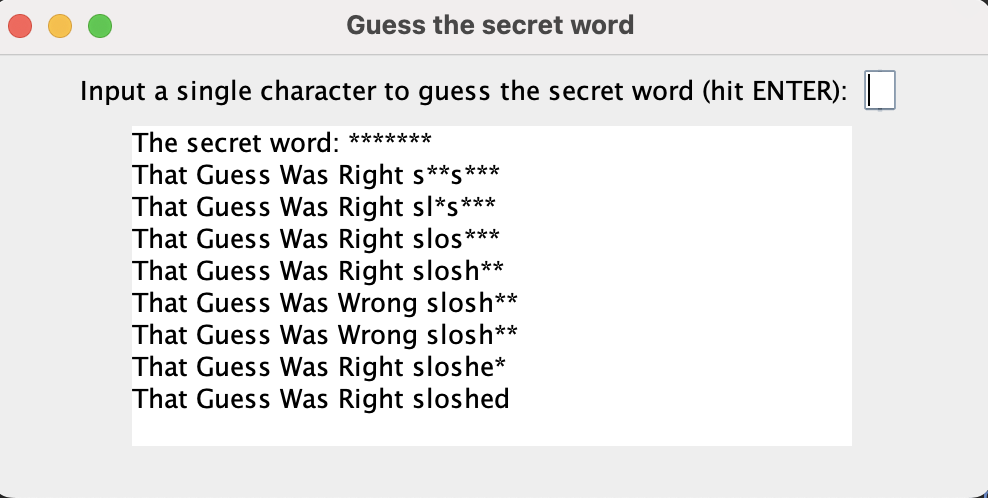

# SecretWord report

Author: Yajur Vashisht

## UML class diagram

@startuml

class SecretWord {

	- secretWord
	- displayedWord
	+ SecretWord()
	+ getDisplayedWord(): string
	+ getSecretWord(): string
	+ updatedWord(s1: String, s2: String, ch: char)
	+ replaceChars(s: String, ch: char)
	+ makeGuess(ch: char)

}

@enduml

## Execution and Testing

# Reflection

I enjoyed re-solidifying concepts we have already learned combined with the new string and iteration stuff we learned in the latest class. I disliked using the GUI and the specific requirements/info provided for SecretWord.
