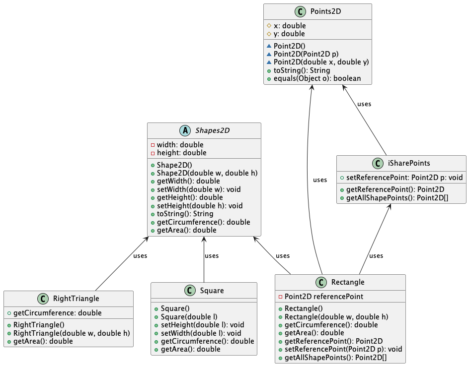
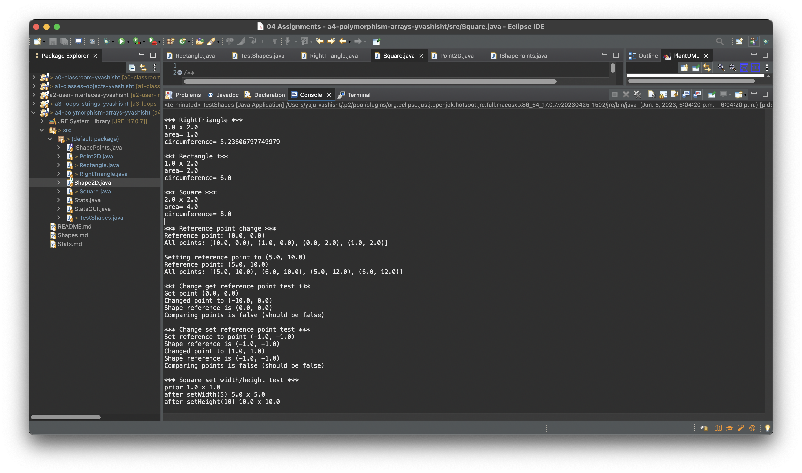

# Shapes report

Author: Yajur Vashisht

## UML class diagram

@startuml

	class RightTriangle {
	+RightTriangle()
	+RightTriangle(double w, double h)
	+getCircumference: double
	+getArea(): double 
	}

	class Square {
	+Square()
	+Square(double l)
	+setHeight(double l): void
	+setWidth(double l): void
	+getCircumference(): double
	+getArea(): double
	}

	class Rectangle {
	-Point2D referencePoint
	+Rectangle()
	+Rectangle(double w, double h)
	+getCircumference(): double
	+getArea(): double
	+getReferencePoint(): Point2D
	+setReferencePoint(Point2D p): void
	+getAllShapePoints(): Point2D[] 
	}

	abstract Shapes2D {
	-width: double
	-height: double
	+Shape2D()
	+Shape2D(double w, double h)
	+getWidth(): double
	+setWidth(double w): void
	+getHeight(): double
	+setHeight(double h): void
	+toString(): String
	+getCircumference(): double
	+getArea(): double
	}

	class iSharePoints {
	+getReferencePoint(): Point2D
	+setReferencePoint: Point2D p: void
	+getAllShapePoints(): Point2D[] 
	}
	
	class Points2D {
	#x: double
	#y: double
	~Point2D()
	~Point2D(Point2D p)
	~Point2D(double x, double y)
	+toString(): String
	+equals(Object o): boolean
	}

	Shapes2D <-- Rectangle : uses
	Shapes2D <-- RightTriangle : uses
	Shapes2D <-- Square : uses
	iSharePoints <-- Rectangle : uses
	Points2D <-- Rectangle : uses
	Points2D <-- iSharePoints : uses

@enduml

## Execution and Testing

