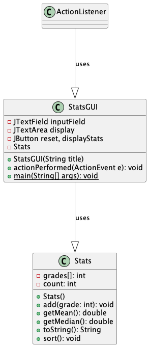
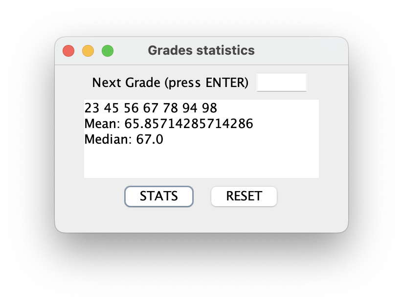

# Stats report

Author: Yajur Vashisht

## UML class diagram

@startuml

	class Stats {
	- grades[]: int
	- count: int
	+ Stats()
	+ add(grade: int): void
	+ getMean(): double
	+ getMedian(): double
	+ toString(): String
	+ sort(): void
	}
	
	class StatsGUI {
	
	- JTextField inputField
	- JTextArea display
	- JButton reset, displayStats
	- Stats
	+StatsGUI(String title)
	+actionPerformed(ActionEvent e): void
	+{static} main(String[] args): void
	}
	
	ActionListener ---|> StatsGUI: uses
	StatsGUI ---|> Stats: uses
	
@enduml

## Execution and Testing

# Reflection

I liked doing more complex assignments and feeling like we are now transitioning to, dare I say, more complicated coding like in real life applications. However, I struggled with wrapping my head around the implements part of rectangle.java and found it difficult.