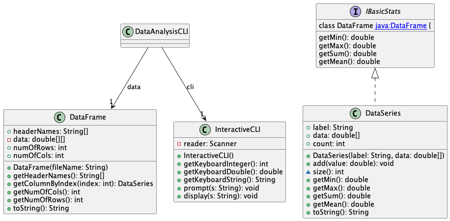
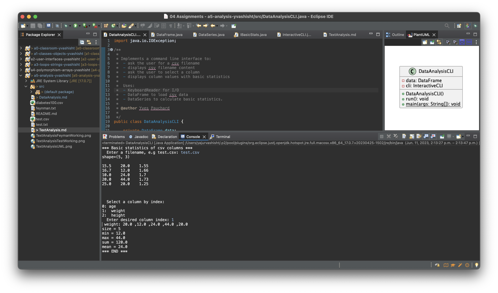
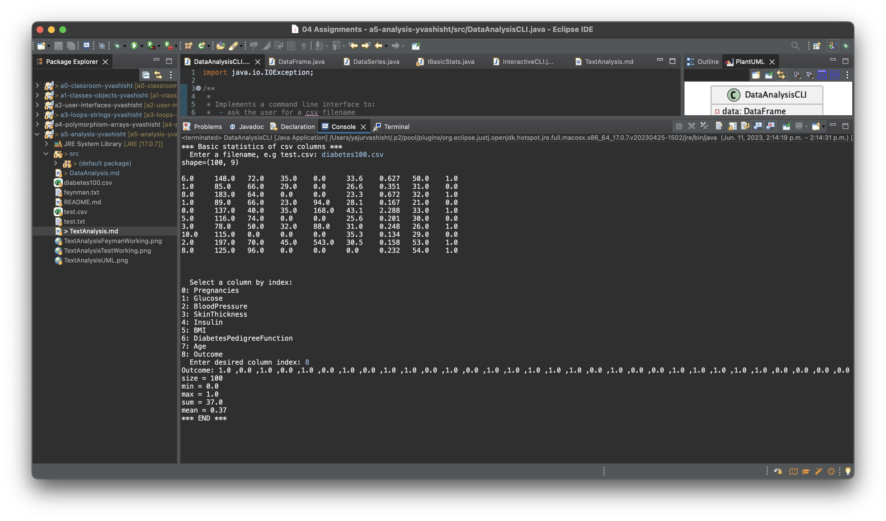
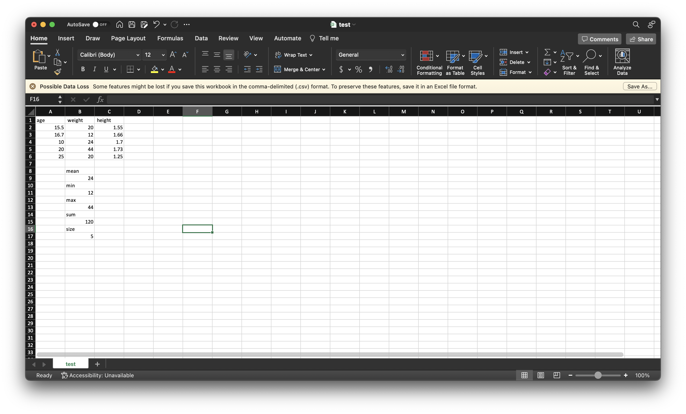
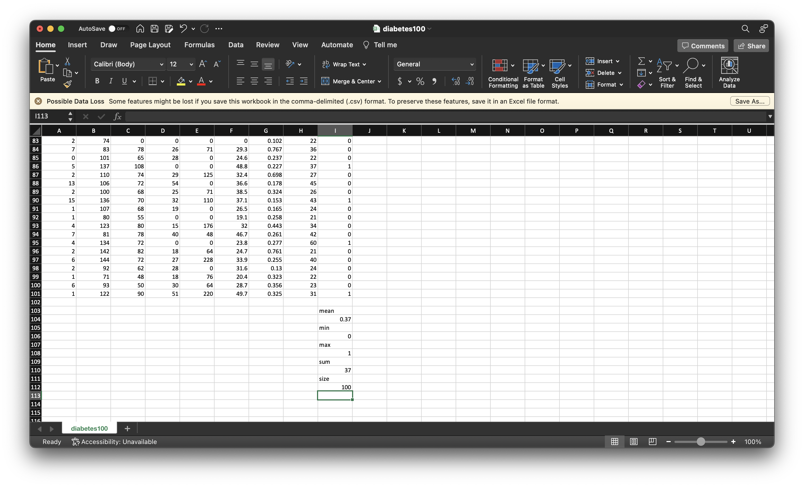

# Data Analysis report
Author: Yajur Vashisht

## UML class diagram

@startuml

	class DataFrame [[java:DataFrame]] {
	+headerNames: String[]
	-data: double[][]
	+numOfRows: int
	+numOfCols: int
	+DataFrame(fileName: String)
	+getHeaderNames(): String[]
	+getColumnByIndex(index: int): DataSeries
	+getNumOfCols(): int
	+getNumOfRows(): int
	+toString(): String
	}
	interface IBasicStats [[java:IBasicStats]] {
	getMin(): double
	getMax(): double
	getSum(): double
	getMean(): double

	class DataFrame [[java:DataFrame]] {
	}
	DataAnalysisCLI --> "1" DataFrame : data
	class InteractiveCLI [[java:InteractiveCLI]] {
	}
	DataAnalysisCLI --> "1" InteractiveCLI : cli
	class InteractiveCLI [[java:InteractiveCLI]] {
	-reader: Scanner
	+InteractiveCLI()
	+getKeyboardInteger(): int
	+getKeyboardDouble(): double
	+getKeyboardString(): String
	+prompt(s: String): void
	+display(s: String): void
	}

	class DataSeries [[java:DataSeries]] {
	+label: String
	+data: double[]
	+count: int
	+DataSeries(label: String, data: double[])
	+add(value: double): void
	~size(): int
	+getMin(): double
	+getMax(): double
	+getSum(): double
	+getMean(): double
	+toString(): String
	}
	interface IBasicStats [[java:IBasicStats]] {
	}
	IBasicStats <|.. DataSeries
	
@enduml

## Execution and Testing

## Verification of statistics

# Reflection

I found the first part of the assignment in line with our past assignments which made it easy to follow, but the second part was frustrating and I'm not quite sure I completely understand it.
