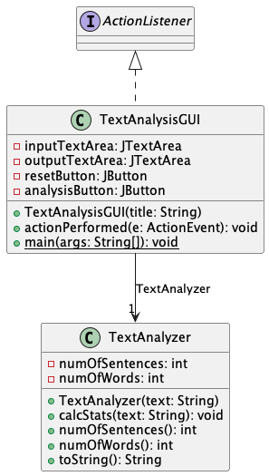
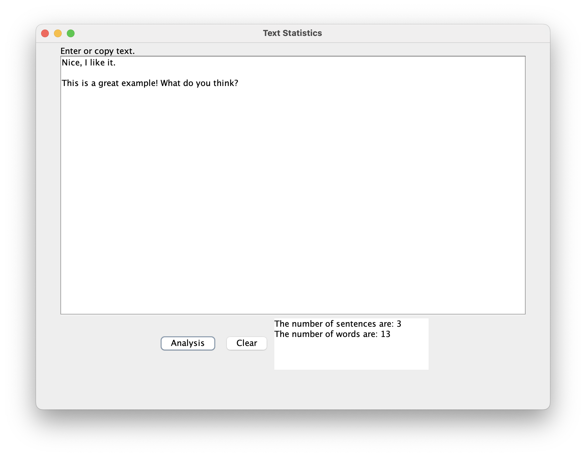
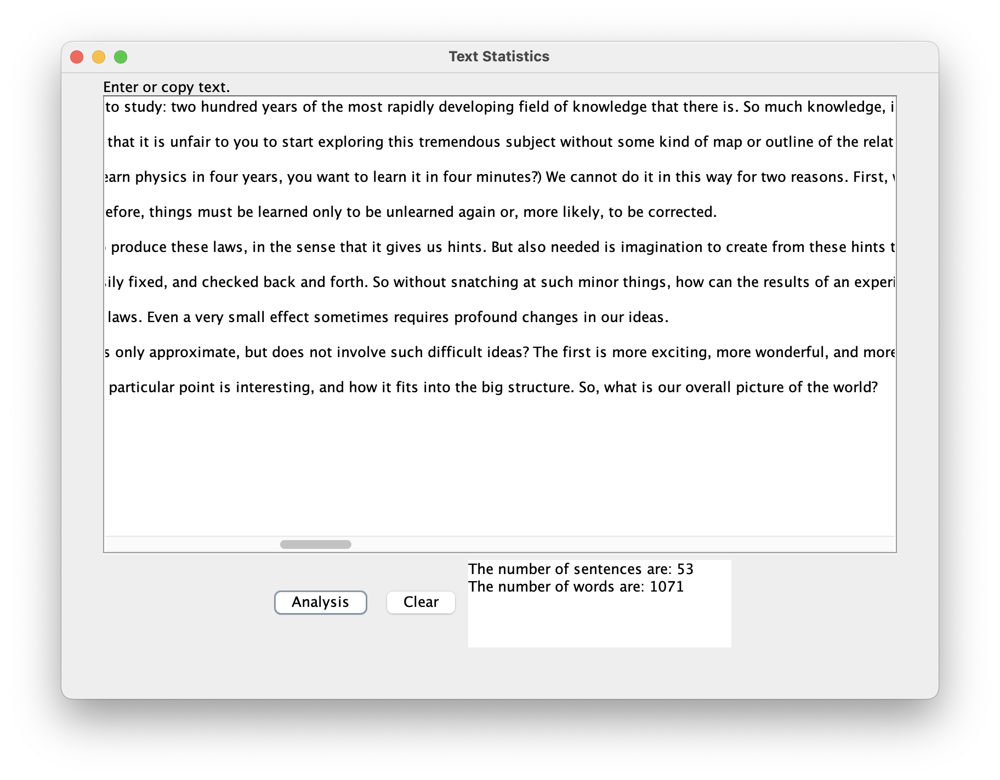

# Text Analysis report
Author: Yajur Vashisht

## UML class diagram

@startuml

	class TextAnalyzer [[java:TextAnalyzer]] {
	-numOfSentences: int
	-numOfWords: int
	+TextAnalyzer(text: String)
	+calcStats(text: String): void
	+numOfSentences(): int
	+numOfWords(): int
	+toString(): String
	}
	class TextAnalysisGUI [[java:TextAnalysisGUI]] {
	-inputTextArea: JTextArea
	-outputTextArea: JTextArea
	-resetButton: JButton
	-analysisButton: JButton
	+TextAnalysisGUI(title: String)
	+actionPerformed(e: ActionEvent): void
	+{static} main(args: String[]): void
	}
	class TextAnalyzer [[java:TextAnalyzer]] {
	}
	TextAnalysisGUI --> "1" TextAnalyzer : TextAnalyzer
	interface ActionListener {
	}
	ActionListener <|.. TextAnalysisGUI

@enduml

## Execution and Testing

